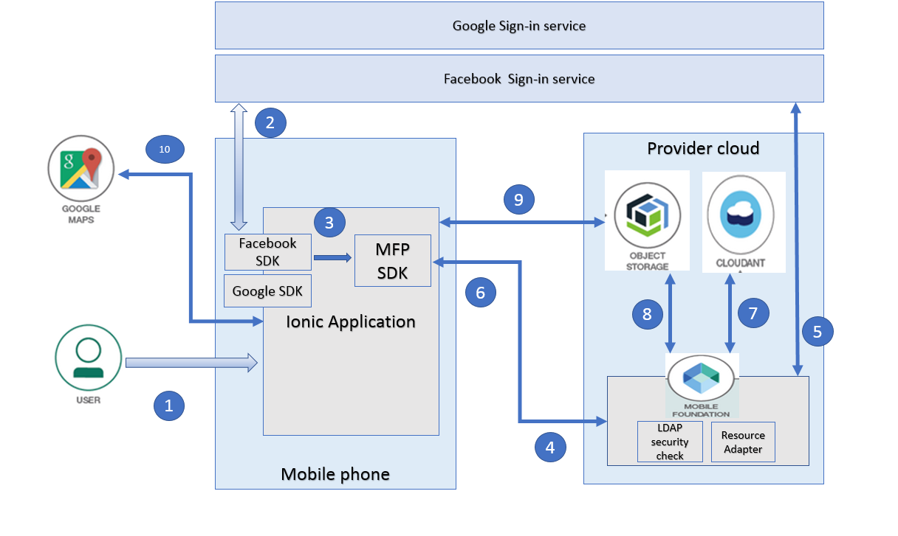
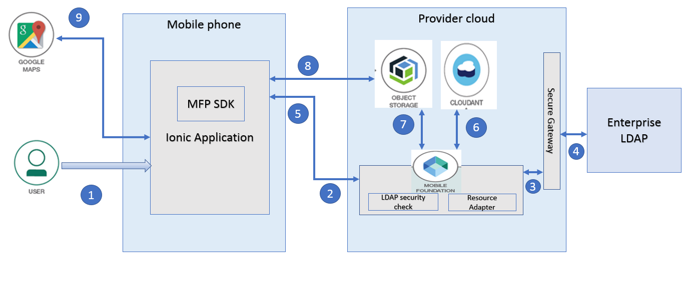
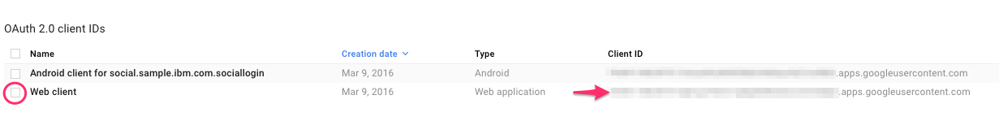
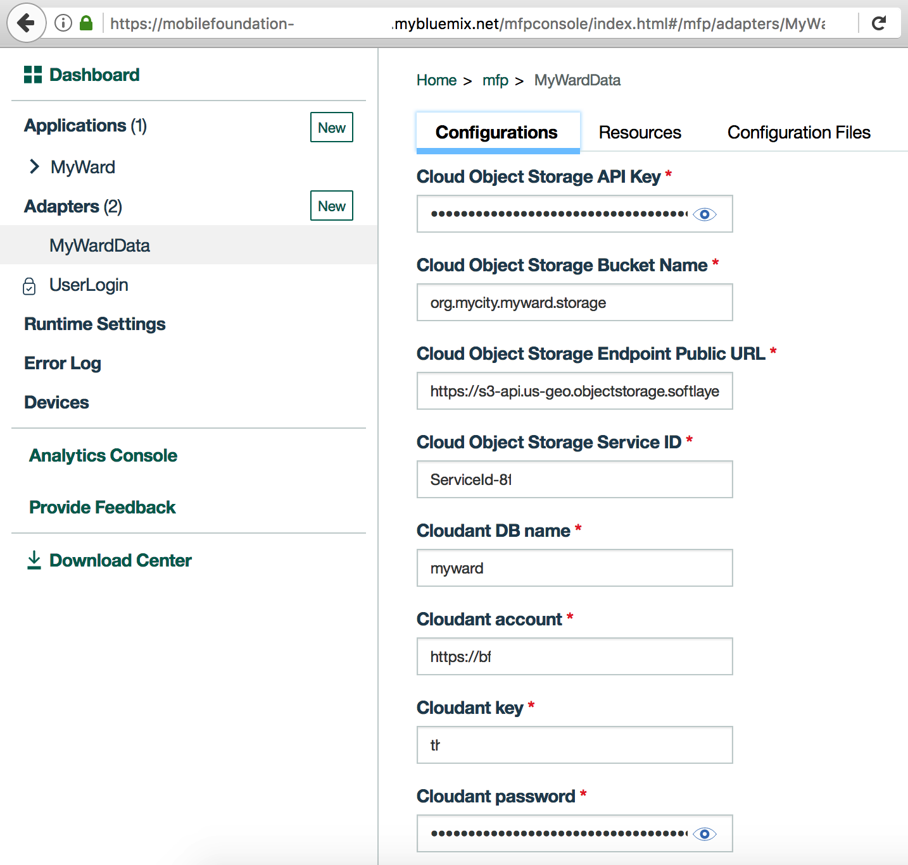
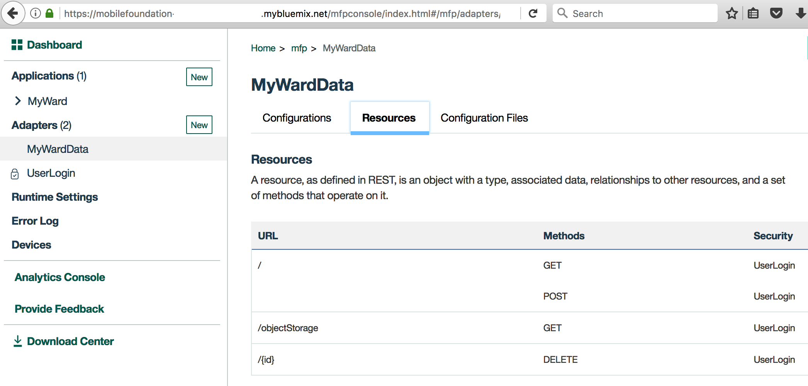
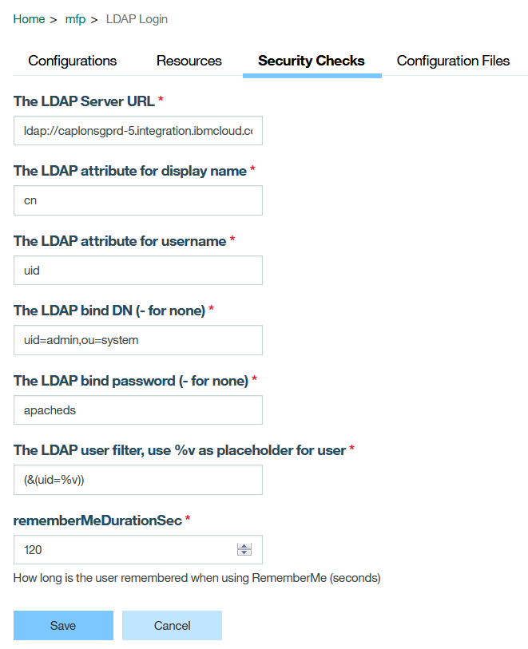
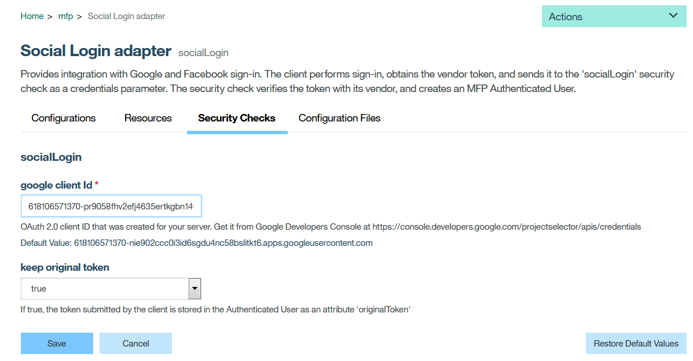

# Mobile User Authentication with On-Premise LDAP Server / Social Login using IBM Mobile Foundation

User authentication is a fundamental requirement in almost all enterprise mobile apps. For internal mobile apps such as those related to payroll, leave and business travel booking, organizations want to leverage single-sign-on by authenticating users against its on-premise LDAP server. And for apps targeted to end users where enterprise data is not exposed such as, an app for product users that allows them to raise service requests, allowing users to authenticate using their social login such as Facebook login/Google login would be much easier. This code pattern shows how developers can leverage IBM Mobile Foundation service to implement following user authentication mechanisms:
* Enterprise login by connecting to on-premise LDAP server using Secure Gateway.
* Social login such as Google login and Facebook login.

When you have completed this code pattern, you will understand:


* How to achieve user authentication in mobile apps where the user repository is an enterprise LDAP server.
* How to achieve user authentication in mobile apps using Social login mechanisms like Google or Facebook.
* How to write MFP adapters that fetch data from Cloud Object Storage service and Cloudant service.
* How to capture user’s geo-location & image from camera and show in Google Maps


## Flow

### Social Login 


The diagram above illustrates the login flow (here described with Google but also relevant to Facebook or other social providers). The diagram shows that the trigger to call social providers is initiated by the client.

1. User launches the mobile app, and clicks on 'Google Sign In' button in the login screen.
2. The Google Android SDK calls the Google Sign-In REST service.
3. The access token from Google is received and the App calls the login API, with scope social-login and credentials (vendor + token).
4. The MFP SDK sends the credentials and scope to the Authorization Server API. The Authorization API calls the mapped security check social-login to validate the credentials.
5. The social-login security check validates the Google token with its web client identifier from the security check configuration. The social-login returns the authenticated user to the Authorization Server API.
6. The Authorization Server API returns the authenticated user data to the MFP SDK. The MFPSDK calls the handleSuccess method in the challenge handler with the authenticated user data. The MFP SDK calls login success callback on the app.
7. If user authentication succeeds, mobile app proceeds to show the home page. As part of this, it makes a call to MFP adapter to fetch the data from Cloudant NoSQL database. MFP adapter fetches the data from Cloudant and returns it to the mobile app. 
8. The data fetched from Cloudant will have references to the images stored in Cloud Object Storage. Mobile app makes a call to MFP adapter to get the Authorization token for interacting with Cloud Object Storage service. MFP adapter makes a call to Cloud Object Storage service's token manager endpoint to get the Authorization token and returns it to the mobile app.
9.  Mobile app initializes image-caching plugin and fetches the images  from Object Storage. Mobile app displays the data obtained from MFP adapter as a list of items.
10. User clicks on one of the list item to see more details. A detail page is shown consisting of image and geo-location marked inside Google Maps.


### Login through on-premise LDAP server ###



1. User launches the mobile app, and clicks on the login button in the login screen.
2. Mobile app invokes the security check adapter deployed on Mobile foundation server to validate the user credentials. 
3. In this case, the security check adapter is a LDAP adapter which connects to the on-premise enterprise LDAP server through a secure gateway client, to do the user credential validation.
4. The enterprise LDAP server validates the credentials and sends the response back to the MFP server through the secure gateway client.
5. The MFP server returns the authenticated user data to the MFP SDK. The MFP SDK calls the handleSuccess method in the challenge handler with the authenticated user data. The MFP SDK calls login success callback on the app.
6. If user authentication succeeds, mobile app proceeds to show the home page. As part of this, it makes a call to MFP adapter to fetch the data from Cloudant NoSQL database. MFP adapter fetches the data from Cloudant and returns it to the mobile app.
7. The data fetched from Cloudant will have references to the images stored in Cloud Object Storage. Mobile app makes a call to MFP adapter to get the Authorization token for interacting with Cloud Object Storage service. MFP adapter makes a call to Cloud Object Storage service's token manager endpoint to get the Authorization token and returns it to the mobile app.
8. Mobile app initializes image-caching plugin and fetches the images  from Object Storage. Mobile app displays the data obtained from MFP adapter as a list of items.
9. User clicks on one of the list item to see more details. A detail page is shown consisting of image and geo-location marked inside Google Maps.


## Included Components
* [Cloudant NoSQL DB](https://console.ng.bluemix.net/catalog/services/cloudant-nosql-db): A fully managed data layer designed for modern web and mobile applications that leverages a flexible JSON schema.
* [Cloud Object Storage](https://console.bluemix.net/catalog/infrastructure/cloud-object-storage): A highly scalable cloud storage service, designed for high durability, resiliency and security.
* [Mobile Foundation](https://console.bluemix.net/catalog/services/mobile-foundation): A scalable mobile access gateway powered by the market-leading IBM Mobile Foundation Technology. The service offers a comprehensive set of mobile backend capabilities such as, App life cycle, Push, Analytics, Feature Toggle, Security and Authentication and offline synch.
* [Secure Gateway](https://console.bluemix.net/catalog/services/secure-gateway):  A quick, easy, and secure solution that provides a persistent connection between on-premises or third party cloud environments and the IBM Cloud.

## Featured Technologies
* [Mobile](https://mobilefirstplatform.ibmcloud.com/): Systems of engagement are increasingly using mobile technology as the platform for delivery.

# Watch the Video

# Steps

* [1. Setup Ionic and MFP CLI](https://github.com/IBM/Ionic-MFP-App#step-1-setup-ionic-and-mfp-cli)
* [2. Create Cloudant database and populate it with sample data](https://github.com/IBM/Ionic-MFP-App#step-2-create-cloudant-database-and-populate-it-with-sample-data)
* [3. Create IBM Cloud Object Storage service and populate it with sample data](https://github.com/IBM/Ionic-MFP-App#step-3-create-ibm-cloud-object-storage-service-and-populate-it-with-sample-data)
* [4. Create Mobile Foundation service and configure MFP CLI](https://github.com/IBM/Ionic-MFP-App#step-4-create-mobile-foundation-service-and-configure-mfp-cli)
* [5. Setup LDAP server and Secure Gateway Client](#step-5-setup-ldap-server-and-secure-gateway-client)
* [6. Register Android App with Google and Facebook for Social Login ](#step-6-register-android-app-with-google-and-facebook-for-social-login)
* [7. Download source repo and customize](#step-7-download-source-repo-and-customize)
  - [7.1 Clone repo](#step-71-clone-repo)
  - [7.2 Update App ID, Name and Description](#72-update-app-id-name-and-description)
  - [7.3 Specify Cloudant credentials in MFP adapter](#73-specify-cloudant-credentials-in-mfp-adapter)
  - [7.4 Specify Cloud Object Storage credentials in MFP Adapter](#74-specify-cloud-object-storage-credentials-in-mfp-adapter)
  - [7.5  Specify LDAP Credentials in MFP Adapter](#75-specify-ldap-credentials-in-mfp-adapter)
  - [7.6 Specify Google Sign-in credentials in MFP Adapter](#76-specify-google-sign-in-credentials-in-mfp-adapter)
  - [7.7 Specify the Facebook AppID and Google clientID in the Ionic App](#77-specify-the-facebook-appid-and-google-clientid-in-the-ionic-app)
* [8. Deploy the MFP Adapters and Test them](#8-deploy-the-mfp-adapters-and-test-them)
  - [8.1 Build and Deploy the MFP adapters](#81-build-and-deploy-the-mfp-adapters)
  - [8.2 Launch MFP dashboard and verify adapter configurations](#82-launch-mfp-dashboard-and-verify-adapter-configurations)
  
* [9. Run application on Android phone](https://github.com/IBM/Ionic-MFP-App#step-7-run-application-on-android-phone)


## Prerequisite steps
This project builds on top of https://github.com/IBM/Ionic-MFP-App. Run following steps from that [base project](https://github.com/IBM/Ionic-MFP-App) to provision the needed mobile backend services from IBM Cloud and populate them with sample data, as well as to setup Ionic and MFP CLI on your development machine.

 * [Step 1. Setup Ionic and MFP CLI](https://github.com/IBM/Ionic-MFP-App#step-1-setup-ionic-and-mfp-cli) 
 * [Step 2. Create Cloudant database and populate it with sample data](https://github.com/IBM/Ionic-MFP-App#step-2-create-cloudant-database-and-populate-it-with-sample-data)
 * [Step 3. Create IBM Cloud Object Storage service and populate it with sample data](https://github.com/IBM/Ionic-MFP-App#step-3-create-ibm-cloud-object-storage-service-and-populate-it-with-sample-data)
 * [Step 4. Create Mobile Foundation service and configure MFP CLI](https://github.com/IBM/Ionic-MFP-App#step-4-create-mobile-foundation-service-and-configure-mfp-cli)
 * [Step 5. Setup LDAP server and Secure Gateway Client](#step-5-setup-ldap-server-and-secure-gateway-client)
 * [Step 6. Register Android App for Google and Facebook Social login](#step-6-register-android-app-for-google-and-facebook-social-login)


## Step 5. Setup LDAP server and Secure Gateway Client
### 5.1 Setup LDAP server
If you have your enterprise LDAP server setup and running, you can skip the rest of this section and move to 'Setup Secure Gateway Client' section. 
If you do not have any LDAP server setup, you could try installing apacheDS - http://directory.apache.org/apacheds. The basic install and setup guide for apacheDS is available at - http://directory.apache.org/apacheds/basic-user-guide.html (please refer section 1).
Import the sample data available [here](http://directory.apache.org/apacheds/basic-ug/resources/apache-ds-tutorial.ldif) by following steps [here](http://directory.apache.org/apacheds/basic-ug/1.5-sample-configuration.html).
Add a new entry with your details, for example,

* cn: Shiva Kumar H R
* sn: ShivaHR
* description: Bluemix Solution Architect
* givenname: Shiva
* mail: shivahr@in.ibm.com
* uid: shivahr
* userpassword: sh1vahr

### 5.2 Setup Secure Gateway Client

To be able to access your on-premise LDAP server from within the Mobile Foundation server running on Bluemix, we must first create a secure gateway connection between the on-premise LDAP server and Bluemix as per following steps:

 

1. Log on to Bluemix. Click on "Catalog". Under Categories, select "Services -> Integrate", and then click on "Secure Gateway". Click "Create".

2. Inside the Secure Gateway service dashboard, click "Add Gateway". Specify a name and click "Add Gateway". Click the icon for the gateway that you just added.

3. Click "Add Clients". Leave the default selection of "IBM Installer" as-is. Note down the "Gateway ID" and "Security Token".

4. Copy the Download URL for the Secure Gateway Client installer for the OS where LDAP server is running.

 
5. Log on to the on-premise machine where LDAP server is running. Download the Secure Gateway Client installer using the download URL obtained from Secure Gateway dashboard. Install and start the Secure Gateway Client by using instructions available [here](https://console.bluemix.net/docs/services/SecureGateway/secure_gateway.html).
Add the LDAP server as a destination in the secure gateway client using instructions available [here](https://console.bluemix.net/docs/services/SecureGateway/securegateway_destination.html#adding-a-destination).
If the newly added destination shows a raised hand in red colour with info "Access blocked by ACL", then make sure you have run "acl allow host:port" in Secure Gateway Client command-line.

6. On the destination that we just added, click on the Settings button. Copy value under Cloud Host : Port (cap-sg-prd-5.integration.ibmcloud.com:16801). This is what we will specify in our MobileFirst Adapter as the hostname:port of LDAP server.


## Step 6. Register Android App with Google and Facebook for Social Login


1. Get the Google Web Client ID by registering the app at [Google API console](https://console.developers.google.com/apis/credentials)



2. Get the Facebook App ID by registering that app at [Facebook apps console](https://developers.facebook.com/apps/)


## Step 7. Download source repo and customize

### 7.1 Clone repo

```
$ git clone https://github.com/IBM/MFP-Auth-LDAP.git
$ cd MFP-Auth-LDAP
```

### 7.2 Update App ID, Name and Description

Update `IonicMobileApp/config.xml` as below. Change `id`, `name`, `description` and `author` details appropriately.

<pre><code>
&lt;?xml version='1.0' encoding='utf-8'?&gt;
&lt;widget <b>id="org.mycity.myward"</b> version="2.0.0" xmlns="http://www.w3.org/ns/widgets" xmlns:cdv="http://cordova.apache.org/ns/1.0" xmlns:mfp="http://www.ibm.com/mobilefirst/cordova-plugin-mfp"&gt;
    <b>&lt;name&gt;MyWard&lt;/name&gt;
    &lt;description&gt;Get your civic issues resolved by posting through this app.&lt;/description&gt;
    &lt;author email="shivahr@gmail.com" href="https://developer.ibm.com/code/author/shivahr/"&gt;Shiva Kumar H R&lt;/author&gt;</b>
...
</code></pre>

### 7.3 Specify Cloudant credentials in MFP adapter

Open `MobileFoundationAdapters/MyWardData/src/main/adapter-resources/adapter.xml` and update the following properties to point to the Cloudant database created in [Step 2](#step-2-create-cloudant-database-and-populate-it-with-sample-data).
 * Update `key` and `password` with the Cloudant API key as generated in [Step 2.2](#22-generate-cloudant-api-key).
 * For property `account`, specify the Cloudant Dashboard URL portion upto (and including) *-bluemix.cloudant.com* as shown in the snapshot of [Step 2.2](#22-generate-cloudant-api-key).
 * For property `DBName`, leave the default value of `myward` as-is.

<pre><code>
&lt;mfp:adapter name="MyWardData" ...&gt;
  <b>&lt;property name="account" displayName="Cloudant account" defaultValue=""/&gt;
  &lt;property name="key" displayName="Cloudant key" defaultValue=""/&gt;
  &lt;property name="password" displayName="Cloudant password" defaultValue=""/&gt;
  &lt;property name="DBName" displayName="Cloudant DB name" defaultValue="myward"/&gt;</b>
  ...
&lt;/mfp:adapter&gt;
</code></pre>


### 7.4 Specify Cloud Object Storage credentials in MFP Adapter

Open `MobileFoundationAdapters/MyWardData/src/main/adapter-resources/adapter.xml` and update the following properties to point to the Cloud Object Storage created in [Step 3](#step-3-create-ibm-cloud-object-storage-service-and-populate-it-with-sample-data).
  * Specify value for `bucketName` as created in [Step 3.1](#31-create-ibm-cloud-object-storage). 
  * Specify `serviceId` and `apiKey` created in [Step 3.2](#32-create-service-id-and-api-key-for-accessing-objects).
  * While creating the bucket in [Step 3.1](#31-create-ibm-cloud-object-storage), if you selected a different Location/Resiliency, then update the `endpointURL` as per the specification in https://console.bluemix.net/docs/services/cloud-object-storage/basics/endpoints.html#select-regions-and-endpoints.

<pre><code>
&lt;mfp:adapter name="MyWardData" ...&gt;
  ...
  <b>&lt;property name="endpointURL" displayName="Cloud Object Storage Endpoint Public URL" defaultValue="https://s3-api.us-geo.objectstorage.softlayer.net"/&gt;
  &lt;property name="bucketName" displayName="Cloud Object Storage Bucket Name" defaultValue=""/&gt;
  &lt;property name="serviceId" displayName="Cloud Object Storage Service ID" defaultValue=""  /&gt;
  &lt;property name="apiKey" displayName="Cloud Object Storage API Key" defaultValue=""/&gt;</b>
&lt;/mfp:adapter&gt;
</code></pre>

### 7.5 Specify LDAP Credentials in MFP Adapter

Open `MobileFoundationAdapters/LDAPLoginAdapter/src/main/adapter-resources/adapter.xml' and update the following properties to point to the Secure Gateway client created in [step 5.2](#52-setup-secure-gateway-client)
<pre><code>
&lt;property name="ldapUserAttribute" defaultValue="uid" displayName="The LDAP attribute for username"/&gt;
		&lt;property name="ldapNameAttribute" defaultValue="cn" displayName="The LDAP attribute for display name"/&gt;
		&lt;property name="ldapURL" defaultValue="ldap://caplonsgprd-5.integration.ibmcloud.com:15315" displayName="The LDAP Server URL"/&gt;
		&lt;property name="userFilter" defaultValue="(&amp;(uid=%v))" displayName="The LDAP user filter, use %v as placeholder for user"/&gt;
		&lt;property name="bindDN" defaultValue="uid=admin,ou=system" displayName="The LDAP bind DN (- for none)"/&gt;
&lt;property name="bindPassword" defaultValue="apacheds" displayName="The LDAP bind password (- for none)" type="string"/&gt;

</code></pre>

### 7.6 Specify Google Sign-in credentials in MFP Adapter
Open `MobileFoundationAdapters/SocialLoginAdapter/src/main/adapter-resources/adapter.xml ' and update the google client-id created in [step 6](#6-register-android-app-with-google-and-facebook-for-social-login) as shown below

<pre><code>
&lt;property name="google.clientId"
                  defaultValue="618106571370-nie902ccc0i3id6sgdu4nc58bslabcde.apps.googleusercontent.com"
				  displayName="google client Id"
                  description="OAuth 2.0 client ID that was created for your server. Get it from Google Developers Console
                  at https://console.developers.google.com/projectselector/apis/credentials"/&gt;

</code></pre>

### 7.7 Specify the Facebook AppID and Google clientID in the Ionic App
Install the Cordova and Ionic Facebook plugin using following commands

$ ionic cordova plugin add cordova-plugin-facebook4 --variable APP_ID="your_appid_from_step6" --variable APP_NAME="your application name"

$ npm install --save @ionic-native/facebook


Install the Cordova and Ionic GooglePlus plugin using following commands

$ ionic cordova plugin add cordova-plugin-googleplus --variable REVERSED_CLIENT_ID="reverseclientid_from_step6"

$ npm install --save @ionic-native/google-plus


After the facebook and googleplus plugins are installed, check if the Facebook App ID and Google webclientID obtained in [step 6](#6-register-android-app-with-google-and-facebook-for-social-login) are present in the config.xml file as shown below

```
<plugin name="cordova-plugin-facebook4" spec="^1.9.1">
        <variable name="APP_ID" value="your_appid" />
        <variable name="APP_NAME" value="MyWard" />
    </plugin>
```
```
<plugin name="cordova-plugin-googleplus" spec="^5.3.0">
        <variable name="REVERSED_CLIENT_ID" value="your_reverse_clientid" />
    </plugin>
```

The ```REVERSED_CLIENT_ID``` is the reverse form of the google webclientID obtained in step6.

Also add the webclientID in the auth_handler.ts file in the googlePlusLogin() method.


## Step 8. Deploy the MFP Adapters and Test them

### 8.1 Build and Deploy the MFP adapters

Build and deploy `MyWardData` Adapter as below.

```
$ cd MobileFoundationAdapters/
$ cd MyWardData
$ mfpdev adapter build
$ mfpdev adapter deploy 
```

Note- If the server is not a default one, please mention the server name 'mfpdev adapter deploy command' in the command.


Build and deploy `LDAPLoginAdapter` adapter as below.
```

$ cd ../LDAPLoginAdapter/
$ mfpdev adapter build
$ mfpdev adapter deploy
```

Build and deploy `SocialLoginAdapter` adapter as below.

```
$ cd ../SocialLoginAdapter/
$ mfpdev adapter build
$ mfpdev adapter deploy
```

### 8.2 Launch MFP dashboard and verify adapter configurations

Launch MFP Dashboard as below:
  * In the [IBM Cloud dashboard](https://console.bluemix.net/dashboard/), under `Cloud Foundry Services`, click on the `Mobile Foundation` service you created in [Step 4](https://github.com/IBM/Ionic-MFP-App#step-4-create-mobile-foundation-service-and-configure-mfp-cli). The service overview page that gets shown, will have the MFP dashboard embedded within it. You can also open the MFP dashboard in a separate browser tab by appending `/mfpconsole` to the *url* mentioned in [Step 4](https://github.com/IBM/Ionic-MFP-App#step-4-create-mobile-foundation-service-and-configure-mfp-cli).
  * Inside the MFP dashboard, in the list on the left, you will see the `LDAPLoginAdapter`, `SocialLoginAdapter` and `MyWardData` adapters listed.

Verify MFP Adapter configuration as below:

  1. Inside the MFP dashboard, click on the `MyWardData` adapter. Under `Configurations` tab, you should see the various properties we specified in [Step 7.3](#73-specify-cloudant-credentials-in-mfp-adapter) and [Step 7.4](#74-specify-cloud-object-storage-credentials-in-mfp-adapter) for accessing Cloudant database and Cloud Object Storage as shown below. As an alternative to specifying those property values in `MobileFoundationAdapters/MyWardData/src/main/adapter-resources/adapter.xml` as previously shown in [Step 7.3](#73-specify-cloudant-credentials-in-mfp-adapter) and [Step 7.4](#74-specify-cloud-object-storage-credentials-in-mfp-adapter), you can deploy the adapters with empty `defaultValue`, and once the adapter is deployed, change the values on this page.

  

  * Click on `Resources` tab. You should see the various REST APIs exposed by `MyWardData` adapter as shown below. The `Security` column should show the protecting scope `UserLogin` against each REST method.
    
  

2.	Click open the 'LDAPLoginAdapter' to check its configurations
	 
3.	Click open the 'SocialLoginAdapter' to check its configuration.
 	


## Step 9. Run application on Android phone

Follow the instructions in [Step 7](https://github.com/IBM/Ionic-MFP-App#step-7-run-application-on-android-phone) of base project to run the application on Android phone.
Instead of a plain UserLogin, test the Google Sign-in button or FB sign-in button or the LDAPlogin button.Based on the button chosen, the user authentication validation mechanism will vary.


# Troubleshooting

Please see instructions for [debugging Android hybrid app using Chrome Developer Tools](https://github.com/IBM/Ionic-MFP-App#debugging-android-hybrid-app-using-chrome-developer-tools) or [troubleshooting guide](https://github.com/IBM/MFP-Auth-LDAP/blob/master/TROUBLESHOOTING.md) for solutions to some commonly occuring problems.

# References

*	[Connecting to LDAP servers with IBM MobileFirst Foundation 8.0](https://mobilefirstplatform.ibmcloud.com/blog/2016/07/17/connecting-to-LDAP-with-ibm-mobilefirst-foundation/)
*	[Implementing Social Login Authentication with IBM MobileFirst Platform Foundation 8.0](https://mobilefirstplatform.ibmcloud.com/blog/2016/04/06/social-login-with-ibm-mobilefirst-platform-foundation/)
*	[Authentication and Security](https://mobilefirstplatform.ibmcloud.com/tutorials/en/foundation/8.0/authentication-and-security/)
*	[Facebook Login](https://developers.facebook.com/docs/facebook-login)
*	[Google SignIn](https://developers.google.com/identity/)

# License
[Apache 2.0](LICENSE)
